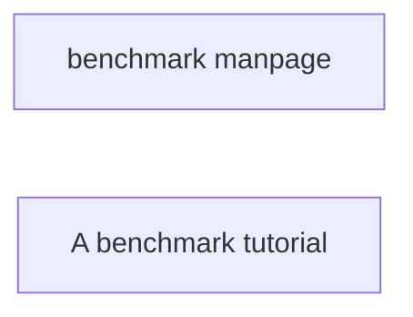

# How to use the plumed benchmark command

The lesson is organized into two parts: a [manual](README.md) and a [small tutorial](Tutorial.md).

You should try to follow the tutorial with the manual opened in a second tab.

