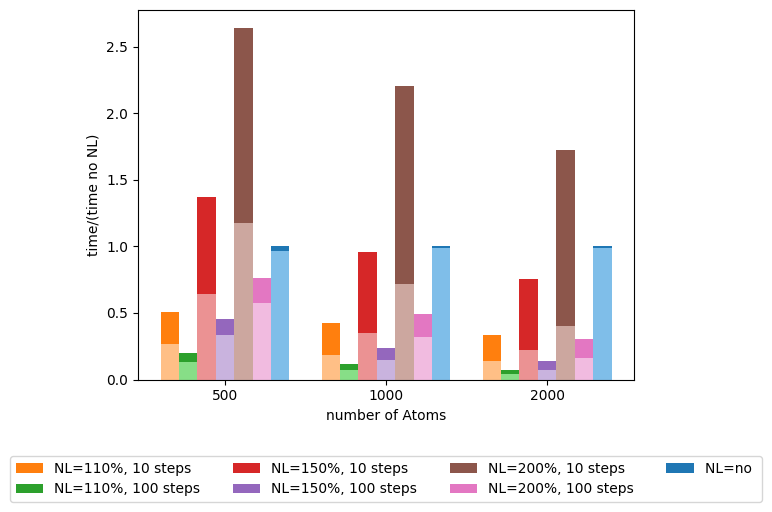

# A simple benchmark example


Now we'll get our hands dirty.

I will make a short demonstration only using the COORDINATION command in plumed, since it is available with a zero-configuration plumed.

We will use the following input as a base for the benchmark
```plumed
cpu: COORDINATION GROUPA=@mdatoms R_0=1

PRINT ARG=* FILE=Colvar FMT=%8.4f STRIDE=1

FLUSH STRIDE=1
```

I will also remove the  backups of the output files with `export PLUMED_MAXBACKUP=0`

#first run

```bash
plumed benchmark --nsteps=500 --natoms=500 --atom-distribution=sc > sc_500.out
```

The first lines of the output are a header with the information needed to reproduce the benchmark run:

```
BENCH:  Welcome to PLUMED benchmark
BENCH:  Using --kernel=this
BENCH:  Using --plumed=plumed.dat
BENCH:  Using --nsteps=500
BENCH:  Using --natoms=500
BENCH:  Using --maxtime=-1
BENCH:  Using --sleep=0
BENCH:  Using --atom-distribution=sc
BENCH:  Initializing the setup of the kernel(s)
```

The final lines contain the time information collected by the internal plumed timers
```
BENCH:  Single run, skipping comparative analysis
BENCH:  
BENCH:  Kernel:      this
BENCH:  Input:       plumed.dat
BENCH:                                                Cycles        Total      Average      Minimum      Maximum
BENCH:  A Initialization                                   1     0.001484     0.001484     0.001484     0.001484
BENCH:  B0 First step                                      1     0.002423     0.002423     0.002423     0.002423
BENCH:  B1 Warm-up                                        99     0.244222     0.002467     0.002401     0.002930
BENCH:  B2 Calculation part 1                            200     0.498634     0.002493     0.002421     0.003136
BENCH:  B3 Calculation part 2                            200     0.498418     0.002492     0.002405     0.003284
PLUMED:                                               Cycles        Total      Average      Minimum      Maximum
PLUMED:                                                    1     1.244841     1.244841     1.244841     1.244841
PLUMED: 1 Prepare dependencies                           500     0.000224     0.000000     0.000000     0.000002
PLUMED: 2 Sharing data                                   500     0.001107     0.000002     0.000002     0.000021
PLUMED: 3 Waiting for data                               500     0.000278     0.000001     0.000000     0.000002
PLUMED: 4 Calculating (forward loop)                     500     1.235230     0.002470     0.002370     0.003254
PLUMED: 5 Applying (backward loop)                       500     0.000402     0.000001     0.000000     0.000005
PLUMED: 6 Update                                         500     0.004534     0.000009     0.000005     0.000056

```
Most of our conclusions will be taken from these parts of the output

## OpenMP


```plumed
cpu: COORDINATION GROUPA=@mdatoms R_0=1

PRINT ARG=* FILE=Colvar FMT=%8.4f STRIDE=1

FLUSH STRIDE=1
```

```bash
for nt in 1 2 4 6 8 10 12; do
    export PLUMED_NUM_THREADS=$nt
    for nat in 100 500 1000; do
        plumed benchmark --nsteps=500 --natoms=$nat --atom-distribution=sc > sc_${nt}_${nat}.out
    done
done
```

My CPU has 6 physical cores but can execute 12 threads. By looking at all the possibilities we can see how t

To extract the data we can use a bash script like:
```bash
for threads in 1 2 4 6 8 10 12; do
    {
    for natoms in 100 500 1000; do
        echo -n "$natoms "
        fname=sc_${threads}_${natoms}.out
        sed -n '/PLUMED: *Cycles *Total *Average *Minimum *Maximum/{n ; p}' "${fname}" |
            awk '{printf "%f ", $3}'
        echo ""
    done
    } > "times_${threads}.out"
done
```

and obtain for each set of threads (here with 6) a table like this :
```
100 0.021471 
500 0.308065 
1000 1.150924 
```

and with a simple python script:
```python
import matplotlib.pyplot as plt
import numpy as np
nthreads=[1,2,4,6,8,10,12]
simPerThread={}
for threads in nthreads:
    simPerThread[threads]=np.loadtxt(f"./run/times_{threads}.out")
fig,ax =plt.subplots()

ncols = len(simPerThread)
x = simPerThread[nthreads[0]][:,0]
x_coord=np.arange(len(x))
width = 0.8/ncols
ax.set_xticks(x_coord + width * 0.5 * (ncols - 1), x)

for multiplier, nt in enumerate(nthreads):
    offset = width * multiplier

    toplot = simPerThread[nt][:,1]
    ax.bar(
            x_coord + offset,
            toplot,
            width,
            label=f"{nt} threads",
        )
       
ax.legend()
ax.set_xlabel("number of Atoms")
ax.set_ylabel("time (s)")
```

Thus we obtain:


We can see how the number of threads speeds up the calculation.

## How to wrongly set up the neighbor list

Computing the NL is a costly operation, but speeds up considerably the coordination calculation if set up correctly. 
The neighbor list operation compiles a list of atom pairs within the cutoff every `NL_STRIDE` steps, this makes the calculation of the coordination more efficient since it will be run on a subset of the total possible pairs of atoms.

`NL_STRIDE` should be set up with the system in mind: if the system is expected to show low atom mobility it is possible to choose a higher stride
In the following run we can see how the benchmark can help in choosing the correct settings for your analysis/run.

Now we prepare two series of inputs with the neighbor list cutoff at 110, 150 and 200% of `R_0`, and with `NL_STRIDE` set to 100 or 10 steps.
the files called `plumedNL%.dat`:

```plumed
cpu: COORDINATION GROUPA=@mdatoms R_0=1 NLIST NL_CUTOFF=1.1 NL_STRIDE=100

PRINT ARG=* FILE=Colvar FMT=%8.4f STRIDE=1

FLUSH STRIDE=1
```
the files called `plumedNL%_shortstride.dat`:
```plumed
cpu: COORDINATION GROUPA=@mdatoms R_0=1 NL_CUTOFF=2 NL_STRIDE=10

PRINT ARG=* FILE=Colvar FMT=%8.4f STRIDE=1

FLUSH STRIDE=1
```

The script that I used is:
The results obtained are:


In this image, the lighter part of each column is the time that plumed passes in the calculate() part of the analysis

<details>
  <summary>Script to produce the image</summary>


`plumed_bench_pp` is a python package (`pip install -U plumed-bench-pp`) that I wrote to speed up the post processing of the result of the benchmark
```python
from plumed_bench_pp.parser import parse_full_benchmark_output
from plumed_bench_pp.tabulate import convert_to_table
from plumed_bench_pp.plot import plot_histo
import plumed_bench_pp.constants as plmdbppconst
import plumed_bench_pp.utils as plmdbpputils
import matplotlib.pyplot as plt
import numpy as np
nthreads=[1,2,4,6,8,10,12]

def lighten_color(color, amount=0.5):
    """
    Lightens the given color by multiplying (1-luminosity) by the given amount.
    Input can be matplotlib color string, hex string, or RGB tuple.

    Examples:
    >> lighten_color('g', 0.3)
    >> lighten_color('#F034A3', 0.6)
    >> lighten_color((.3,.55,.1), 0.5)
    """
    import matplotlib.colors as mc
    import colorsys

    try:
        c = mc.cnames[color]
    except:
        c = color
    c = colorsys.rgb_to_hls(*mc.to_rgb(c))
    return colorsys.hls_to_rgb(c[0], 1 - amount * (1 - c[1]), c[2])
benchmarks100=[]
benchmarks10=[]
#preload the full files in memory
for atoms in [500, 1000, 2000]:
    with open(f"./run/sc_NL_shortstride_{atoms}.out") as f:
        benchmarks10.append(parse_full_benchmark_output(f.readlines()))
    with open(f"./run/sc_NL_{atoms}.out") as f:
        benchmarks100.append(parse_full_benchmark_output(f.readlines()))

#extract the rows we want to plot from the preloaded files
rows_to_extract=[plmdbppconst.TOTALTIME,plmdbppconst.CALCULATE]
t=[]

for perc in [110, 150, 200]:
    t.append(convert_to_table(benchmarks10,kernel="this",inputlist=f"plumedNL{perc}_shortstride.dat",rows_to_extract=rows_to_extract))
    t.append(convert_to_table(benchmarks100,kernel="this",inputlist=f"plumedNL{perc}.dat",rows_to_extract=rows_to_extract))
t.append(convert_to_table(benchmarks10,kernel="this",inputlist="plumed.dat",rows_to_extract=rows_to_extract))

#these are the label of the columns
NL=["110%, 10 steps" , "110%, 100 steps", "150%, 10 steps", "150%, 100 steps", "200%, 10 steps", "200%, 100 steps","no"]
#plot the histogram with a fancy layout
fig,ax =plt.subplots()
colors=[f"C{i}" for i in range(1,len(t))]+["C0"]
lc=[lighten_color(c) for c in colors]
plot_histo(ax,t,plmdbppconst.TOTALTIME, titles=[f"NL={nl} " for nl in NL],relative_to=-1,colors=colors) 
plot_histo(ax,t,plmdbppconst.CALCULATE, relative_to=-1, relative_to_row=plmdbppconst.TOTALTIME,colors=lc) 

ax.set_xlabel("number of Atoms")
ax.legend(ncols=4,loc="lower center", bbox_to_anchor=(0.5, -0.35))
ax.set_ylabel("time/(time no NL)")
```
  
</details>

- coordination
- coordination with  NL
- coordination with NL -exaggerated cut off
- explain the header and the post-log

some graph and pp
perf example
